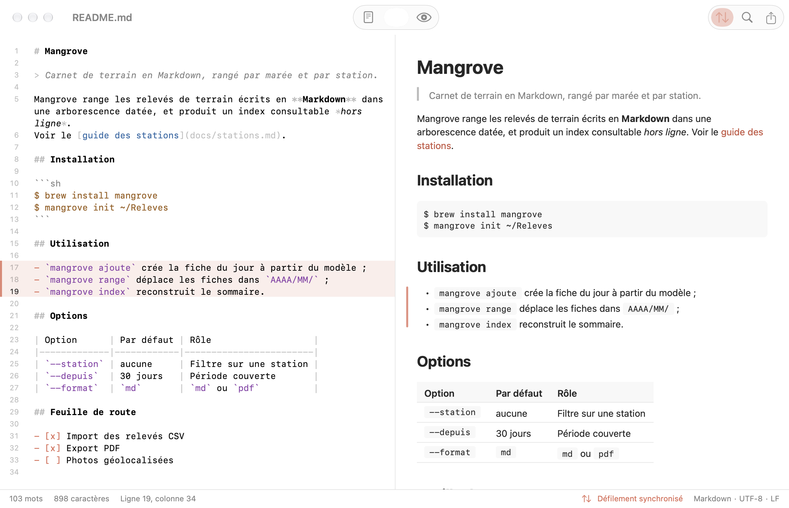

<p align="center">
  <picture>
    <source media="(prefers-color-scheme: dark)" srcset="docs/kayakoma-logo-dark.svg">
    
  </picture>
</p>

# Kayakoma Editor

Kayakoma Editor is a native Markdown editor for macOS: the source on the left, the rendered document on the right. Rendering is native, with no WebView, no HTML and no JavaScript: it is done by KayakomaKit, the rendering engine, which lives in its own repository. The rendered side is never editable: there is no WYSIWYG mode, you edit the Markdown itself.

The name: "Kaya koma" means "it is not finished" in Shimaore (Mayotte) — a nod to Markdown being an unfinished document waiting to be rendered.



The sample document shown above is invented.

## Download

Download the latest version from the [Releases page](https://github.com/beeraw/kayakoma-editor/releases/latest), unzip it and move Kayakoma Editor to your Applications folder. The app is not notarized by Apple, so macOS blocks it the first time: click "Open Anyway" for Kayakoma Editor in System Settings > Privacy & Security (the release notes give the details).

## Features

- Opens, edits and saves Markdown (`.md`, `.markdown`, `.mdown`, `.mkd`) and plain text (`.txt`) files, with the standard macOS document behavior: new documents, undo, autosave and versions.
- Split view with a layout switcher in the toolbar: source only (Command-1), side by side (Command-2) or rendered document only (Command-3).
- Native syntax colouring of the source, with no third-party editor component.
- Line numbers, shown by default (a setting turns them off).
- Return continues a list item, a task item or a quote line; Return on an empty item ends the list.
- Two-way scroll sync: scrolling one pane scrolls the other to the same source line. The toolbar button or the View menu turns it off, and a setting chooses the default for new windows.
- A discreet marker shows the block under the caret, in both the source and the rendered document.
- Status bar with the word and character counts, the line and column, the sync state, and the file's format and encoding. View > Hide Status Bar (Command-/) hides it.
- Find in the document (Command-F).
- PDF export in A4 or US Letter, with real text and clickable links (File > Export as PDF…, Option-Command-E).
- Themes: two built in (Default and Paper) plus your own JSON files, see [Themes](#themes).
- Auto / Light / Dark appearance, text size and line width of the rendered document, and font size of the source, in the settings (Command-comma).
- The file is reloaded when it changes on disk and the window has no unsaved changes. With unsaved changes, saving shows the system's conflict dialog.
- Encodings are preserved: a file read as UTF-8 (with or without BOM) or UTF-16 with a BOM is written back the same way, with its original line endings (LF or CRLF). A file that is not valid UTF-8 is read as Windows-1252, then as ISO Latin-1, and written back in that encoding; if the text can no longer be represented in it, the file is saved as UTF-8 and the status bar says so beforehand.
- Relative images and links are resolved from the document's folder. Remote images are not loaded.
- Kayakoma Viewer's "Modifier" (Edit) button, and its Open in Editor command (Command-E), open the current file in Kayakoma Editor.
- Interface in French and English.

## Requirements

- macOS 14 or later to run
- Xcode 26 or later (the app icon and some controls use the macOS 26 SDK), and [XcodeGen](https://github.com/yonaskolb/XcodeGen), to build

## Building from source

The app depends on [KayakomaKit](https://github.com/beeraw/kayakoma-kit), which Swift Package Manager fetches from GitHub (version 1.0.0 or later, same major version).

```bash
xcodegen generate
```

Then open `KayakomaEditor.xcodeproj` in Xcode and run the `Editor` scheme, or build from the command line:

```bash
xcodebuild -scheme Editor build
```

The Xcode project is generated and not versioned: change `project.yml`, never the project. The app is signed locally (ad hoc), without a developer account. To run the tests:

```bash
xcodebuild -scheme Editor test
```

### Images next to the document

The app is sandboxed, and the sandbox normally grants access to the edited file only, so images referenced by relative paths (``) could not be loaded in the rendered document. The app therefore declares a read-only sandbox exception for file paths (`com.apple.security.temporary-exception.files.absolute-path.read-only` on `/`, see `project.yml`). It lets it read the images next to the document; writing is limited to the files you open or save through the system panels, and the app has no network entitlement. The price is that this kind of exception is generally not accepted on the Mac App Store; this app is meant to be built from source.

### Developing with a local KayakomaKit

To work on the engine at the same time, clone it next to this repository (`../KayakomaKit`) and create a `project.local.yml` file here. It is ignored by git and never committed:

```yaml
include:
  - project.yml
packages:
  KayakomaKit:
    path: ../KayakomaKit
```

The file reuses `project.yml` and only replaces the engine package. Generate the project from it instead of from `project.yml`:

```bash
xcodegen generate --spec project.local.yml
```

To go back to the GitHub package, delete `project.local.yml` (or just stop passing `--spec`) and run `xcodegen generate` again.

## Themes

Open the settings (Command-comma): the theme row lists the built-in themes and the ones found in the themes folder; "Open Themes Folder" shows that folder in the Finder, and "Open Theme File…" validates a JSON file and copies it there. The folder is read again whenever the app becomes active, and a file that cannot be decoded shows a warning naming the faulty key.

A theme file is partial JSON: it only states what it changes, and the rest comes from the default theme. One file covers light and dark. The format is the one of KayakomaKit's `Theme`, documented in the "Theming" section of the [KayakomaKit README](https://github.com/beeraw/kayakoma-kit#theming). For instance:

```json
{
  "fontFamily": "Georgia",
  "backgroundColor": { "light": "#FBF8F2", "dark": "#24211D" },
  "linkColor": { "light": "#0055CC", "dark": "#66AAFF" },
  "maxLineWidth": 680
}
```

Unless a file sets `linkColor`, links keep the app's coral color. A theme only styles the rendered document: the source pane keeps its own colours. The text size and the line width set in the app's settings are applied over the chosen theme.

## Translations

French is the source language: its text is in the code. Every other language is one XLIFF file in `Translations/` (`en.xliff`, …), in the format of Xcode's Export Localizations, so any XLIFF tool can edit it. Each build imports these files into the string catalog; untranslated strings fall back to French. The XLIFF files are the reference: a translation edited in Xcode's catalog editor is replaced at the next build.

To add a language, create its file, with every string untranslated:

```bash
python3 scripts/translations.py export --new es
```

Translate the targets (or drop in a file returned by a translation tool, keeping its `target-language`), then build with the app's scheme: the language is part of the app. No code or project change is needed.

After adding strings in the code, build once in Xcode so that it adds them to the string catalog, then run `python3 scripts/translations.py export`: new strings are added, untranslated, to every XLIFF file, and removed ones are dropped.

`Translations/Translations.xcfilelist` lists the XLIFF files that the sandboxed build phase may read. The script keeps it up to date; commit it with the XLIFF files. `python3 scripts/translations.py selftest` checks the script (the app's tests run it too).

## Limitations

- Source and rendered document are always side by side or alone: no WYSIWYG editing, and the sides cannot be swapped.
- Remote images are not downloaded; they show as a placeholder.
- Files that are not text (binary data) cannot be opened.
- The read-only sandbox exception described above is generally not accepted on the Mac App Store.

## License

MIT, see [LICENSE](LICENSE). Third-party licenses are in [THIRD_PARTY_NOTICES.md](THIRD_PARTY_NOTICES.md) and in the About panel of the app.
